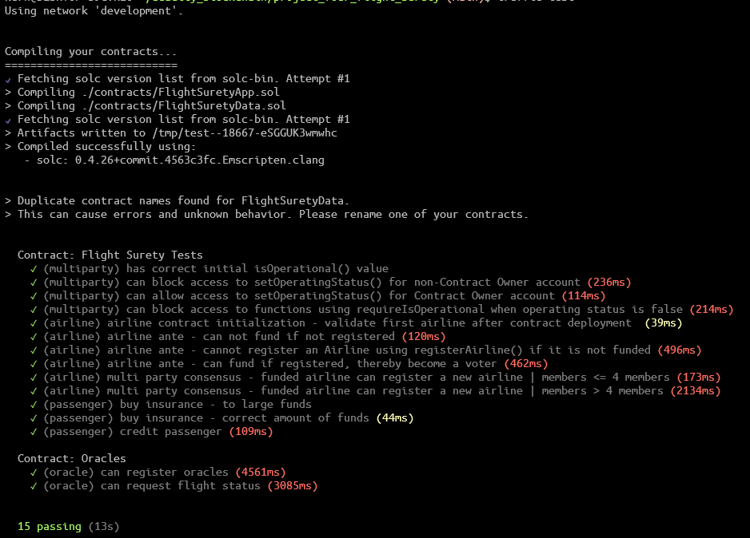
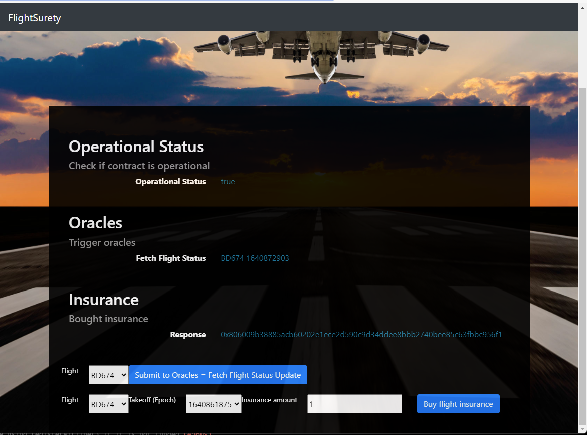

# Flight Surety

**Program**: Blockchain Developer Nanodegree Program

**Project**: Flight Surety

**Date**: 30th of December 2021

The project is about flight delay insurance for passengers.

- Managed as a collaboration between multiple airlines
  
- Passengers purchase insurance prior to flight
  
- If flight is delayed due to airline fault, passengers are paid 1.5x the amount they paid for the insurance.
  
- Oracles are providing flight status information.

## Tools

- `Etherum` decentralized platform for running smart contracts
  
- `Truffle` as a development environment to test and deploy contracts.
  
- `Metamask` browser extension providing wallet functionality to interact with DApp.
  

## Dependencies

Truffle Version: `v.5.2.0`

Solidity: `0.4.25`

Ganache CLI: `v6.12.2`

Node: `v14.16.0`

Web3.js `v.1.2.9`

npm`v7.7.0`

## Setup

```
# smart contract
ganache-cli -l 9999999 -m "candy maple cake sugar pudding cream honey rich smooth crumble sweet treat" --accounts=100
truffle compile # compile contract to build\contracts
truffle migrate # deploy smart contracts
truffle test # run truffle tests

# start up oracle server application
npm run server
# start up frontend dap
truffle migrate
npm run dapp
```

## Results

Running `truffle test` yields:



Viewing the UI allows to trigger Oracles and submit insurance funding.

